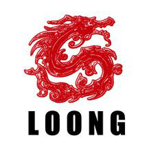
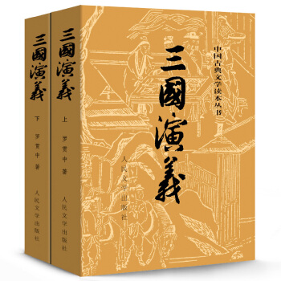

# chenweilong104.github.io
<html>
    <head>
        <title>陈威龙的网站</title>
    </head>
    <body>
        <h1>Hello Page</h1>
        

            
        

        
        
在搭建这个网站时，我一开始在手机上没有合适的pdf查看器，
            打开不了里面的链接，在师兄的推荐下下了好几个pdf查看器，最终
            几番对比下，选择了福昕。Adobe用不了，xpdf有很烦人的弹窗广告
            。然后是表严肃的教学视频，我直接在B站上看的，用手机看很方便。
            然后域名的注册我是看第二篇<a href="https://blog.csdn.net/u012168038/article/details/77715439">博文</a>的
            ，一些不熟悉的标签应用反复查，也算有点熟练了

        
搭建网站的时候还是很爽的，内心很有成就感，有点烦燥的
            是键盘打字还不是很熟，还是要多练，拼音打不准，五笔不会，打
            字的时候很难受。

        <h2>我最喜爱的一本书</h2>
        
 
        
       《三国演义》反映了丰富的历史内容，人物名称、地理名称、主要事件与《三国志》
       基本相同。人物性格也是在《三国志》留下的固定形象基上，才进行再发挥
       ，进行夸张、美化、丑化等等，这也是历史演义小说的套路。《三国演义》
       一方面反映了较为真实的三国历史，照顾到读者希望了解真实历史的需要；
       另一方面，根据明朝社会的实际情况对三国人物进行了夸张、美化、丑化等等
       。故事源起汉灵帝年间刘、关、张桃园结义，描述了东汉末年和三国时期近
       百年发生的重大历史事件，和众多的叱咤风云的英雄人物。作者通过真实动人
       的故事，揭示了封建统治阶级内部的黑暗和腐朽，控诉了统治者的暴虐和丑恶
       。东汉末年，军阀混战，所谓“十八路”诸侯联军征讨董卓，打的是“扶持王室
       ，拯救黎民”的旗号，干的是勾心斗角、尔虞我诈的勾当，都企图称王称霸。
       《三国演义》以没落的汉室宗亲刘备和以宗族起兵的曹操作为两条主线的展
       开了中前期的故事，而中后期以蜀国丞相诸葛亮率领汉军北伐，与魏国重臣
       司马懿的斗智斗勇为主线，以三国归晋而告终。
        

        <blockquote>读书使我快乐</blockquote>
    </body>
</html>